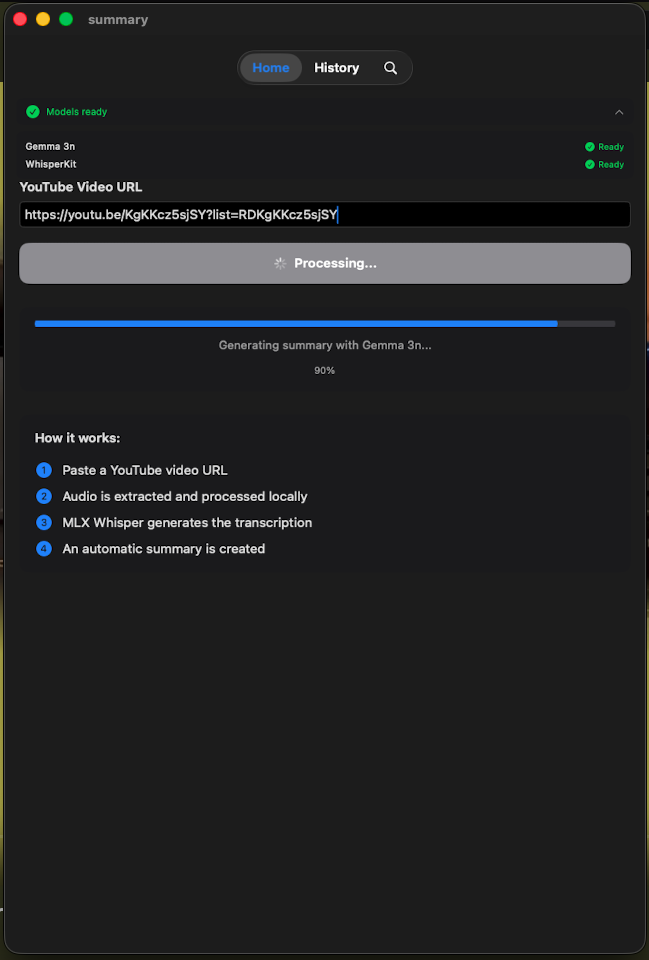

# Summary - YouTube Video Transcription & Summarization

A powerful iOS application that automatically transcribes and summarizes YouTube videos using advanced AI models. Built with SwiftUI and leveraging cutting-edge machine learning technologies.

## 🚀 Features

### Core Functionality

- **YouTube Video Processing**: Extract audio from YouTube videos automatically
- **AI-Powered Transcription**: Convert speech to text using WhisperKit (OpenAI's Whisper model)
- **Intelligent Summarization**: Generate concise summaries using MLX Gemma 3n model
- **Offline Processing**: All AI processing happens locally on your device for privacy
- **History Management**: Keep track of all your transcriptions and summaries
- **Search Functionality**: Easily find past transcriptions

### User Experience

- **Modern SwiftUI Interface**: Clean, intuitive design with smooth animations
- **Real-time Progress Tracking**: Monitor transcription and summarization progress
- **Cross-Platform Support**: Optimized for iPhone, iPad, and macOS (designed for iPad)
- **Efficient Caching**: Smart caching system to avoid reprocessing
- **Error Handling**: Comprehensive error management with user-friendly messages

## 🛠 Technology Stack

### Frameworks & Libraries

- **SwiftUI**: Modern declarative UI framework
- **SwiftData**: Data persistence and management
- **WhisperKit**: On-device speech recognition using OpenAI's Whisper
- **MLX Swift**: Apple's machine learning framework for efficient LLM inference
- **Combine**: Reactive programming for data flow management

### AI Models

- **Whisper**: State-of-the-art speech recognition model
- **Gemma 3n (2B 4-bit)**: Efficient language model for text summarization

### Architecture

- **MVVM Pattern**: Clean separation of concerns
- **Async/Await**: Modern concurrency handling
- **Observable Objects**: Reactive state management
- **Dependency Injection**: Modular and testable code structure

## 🔧 Installation & Setup

### Prerequisites

- Xcode 26.0 or later
- iOS 26.0 or later (> iPhone 15)
- macOS 26.0 or later (for Mac version)

### Dependencies

The project uses Swift Package Manager for dependency management:

- [WhisperKit](https://github.com/argmaxinc/WhisperKit) - On-device speech recognition
- [MLX Swift Examples](https://github.com/ml-explore/mlx-swift-examples) - Machine learning framework

### Build Instructions

1. Clone the repository:

```bash
git clone https://github.com/uplg/summary-swift.git
cd summary-swift
```

2. Open the project in Xcode:

```bash
open summary.xcodeproj
```

3. Build and run using XCode

- if you have an "old" iPhone (< 15), you might need to use macOS (Designed for iPad)
- it may work on iPhones / iPad but it's not fully tested as I don't have a recent Apple device except a Mac, UI follows most recent guidelines and works great but memory issues while loading Gemma 3n on an iPhone 13, backend URL needs to be changed as it is hardcoded to localhost:8000.
- Also, iOS simulator don't handle metal fully, so you might need to use a real device to test the app.

## 🎯 Usage

0. **Start the Backend**: The app use the FastAPI backend found in [Video-summarize](https://github.com/uplg/video-summarize) for easy yt-dlp usage. Make sure to set it up following the instructions in the repository.
1. **Launch the App**: Open Summary on your iOS device
2. **Enter YouTube URL**: Paste any YouTube video URL in the input field
3. **Start Processing**: Tap the process button to begin transcription
4. **Monitor Progress**: Watch real-time progress updates for each processing stage
5. **View Results**: Access transcription and summary in the detail view
6. **Manage History**: Browse, search, and delete past transcriptions

## 🔄 Processing Pipeline

The app follows this processing pipeline:

1. **URL Validation**: Verify YouTube URL format and accessibility
2. **Metadata Extraction**: Retrieve video title, duration, and thumbnail
3. **Audio Download**: Extract and download audio from YouTube video
4. **Model Loading**: Initialize WhisperKit and MLX models (first run only)
5. **Transcription**: Convert audio to text using Whisper model
6. **Summarization**: Generate summary using Gemma 3n model
7. **Storage**: Save results to local database with SwiftData

## 🔒 Privacy & Security

- **Local Processing**: All AI operations happen on-device
- **No Data Collection**: No personal data is sent to external servers
- **Secure Storage**: Transcriptions stored locally using SwiftData
- **Cache Management**: Automatic cleanup of temporary files

## 📱 Screenshots

<div style="display: grid; grid-template-columns: repeat(3, 1fr); justify-items: center;">
  
  
  
</div>

## 🚧 Development Status

This project is actively maintained and continuously improved. Current focus areas:

- Performance optimizations for larger videos
- Enhanced error handling and recovery
- Additional language support for summarization
- Export functionality for transcriptions

## 📄 License

This project is licensed under the MIT License - see the LICENSE file for details.

## 🤝 Contributing

Contributions are welcome! Please feel free to submit a Pull Request. For major changes, please open an issue first to discuss what you would like to change.

## 📞 Support

If you encounter any issues or have questions, please open an issue on GitHub or contact the development team.

---

**Built with ❤️ using SwiftUI, WhisperKit, and MLX**
